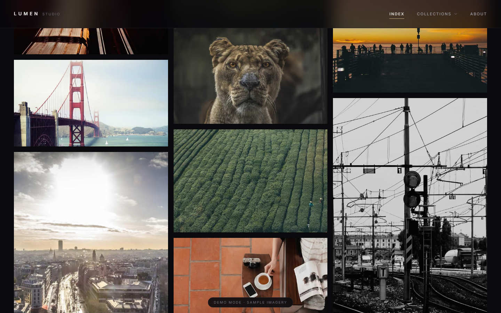
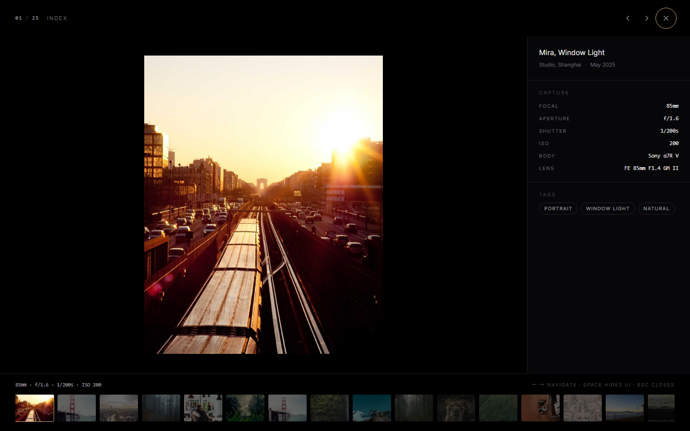
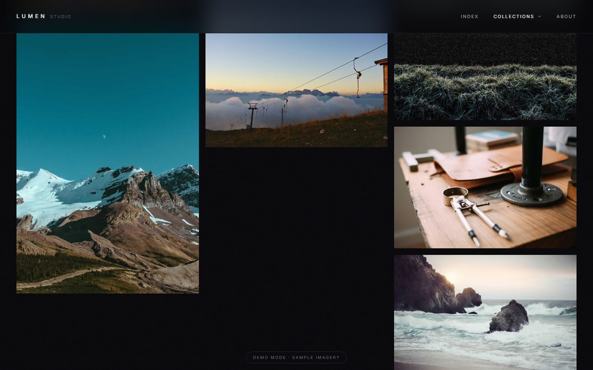
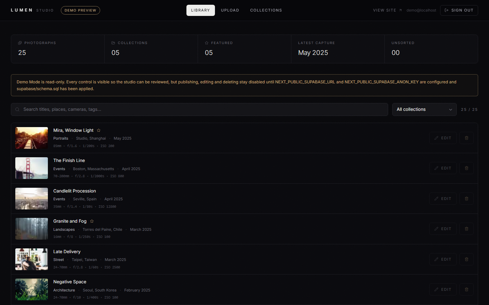
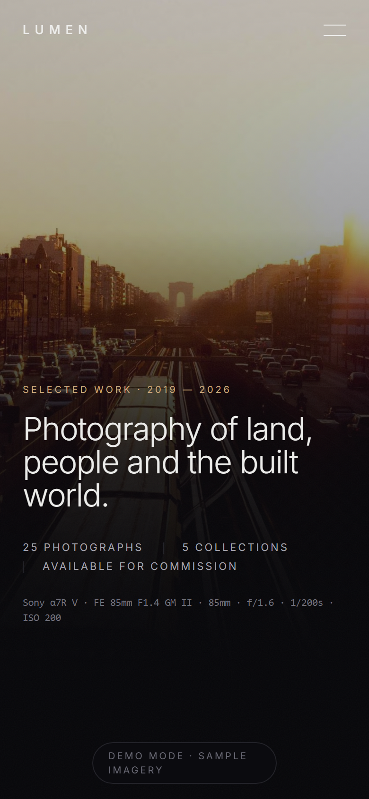

<div align="center">

# LUMEN

**高级个人摄影作品展示网站 · 内置 Supabase 后台管理系统**

深色、克制、以照片为绝对主角 —— 不规则瀑布流、模糊渐亮入场，
以及一个把拍摄参数悬浮在画面边缘的全屏沉浸式灯箱。

[English →](./README.md)

</div>

---

## 目录

- [这是什么](#这是什么)
- [功能一览](#功能一览)
- [技术栈](#技术栈)
- [快速开始](#快速开始)
- [接入 Supabase](#接入-supabase)
- [后台管理](#后台管理)
- [部署到 Vercel](#部署到-vercel)
- [环境变量](#环境变量)
- [目录结构](#目录结构)
- [实现要点](#实现要点)
- [自动化验证](#自动化验证)
- [自定义](#自定义)
- [常见问题](#常见问题)

---

## 这是什么

一个完整、可直接上线的摄影作品站。访客沉浸式浏览作品；站长通过隐藏的
`/admin` 路由登录，上传照片、编辑参数、管理分类。

项目自带 **演示模式（Demo Mode）**：零配置即可运行，用占位图片驱动。
瀑布流、模糊渐亮、灯箱、EXIF 展示全部是真实可交互的。填上 Supabase 密钥后
自动切换到线上数据库，**两个方向都不需要改任何代码**。

| 预览 | |
|---|---|
|  |  |
|  |  |
|  |  |

*（截图取自演示模式，照片本身是占位图。）*

---

## 功能一览

### 访客端

- **不规则瀑布流**：基于 CSS 多列布局，而非 JS 布局引擎 —— 真正的高低错落、
  自动平衡，且在服务端渲染的 HTML 里就是正确的，无水合闪烁。
- **骨架屏 + 模糊渐亮**：每个卡片在发起图片请求之前就已按存储的宽高锁定比例，
  因此列高永远不会跳动。骨架屏占位，照片解码后淡入并从 `blur(16px)` 化开。
- **Scale 1.02 悬停微放大**：非口头承诺，而是实测值 —— 悬停时计算样式精确
  解析为 `1.02`，过渡 1.2 秒，缓动 `cubic-bezier(0.22, 1, 0.36, 1)`。
- **沉浸式全屏灯箱**：纯黑背景铺满视口。点击照片本身可隐藏全部界面元素，
  点击照片以外的区域关闭。
- **悬浮 EXIF 排版**：拍摄参数以极细线条排版悬浮在画面边缘，**焦段排在第一位**
  —— 因为那才是摄影师真正会看的数字：`15mm`、`35mm`、`24-70mm`、`f/1.4`、
  `1/250s`、`ISO 100`、机身、镜头。
- **键鼠与触屏**：`←` `→` 切换、`空格` 隐藏界面、`i` 切换参数面板、`esc` 关闭；
  左右拖拽或滑动切换照片。
- **平滑滚动**：Lenis 接管整个文档；打开灯箱时自动暂停，页面不会在背后滚动。
- **分类体系**：预置风景、活动纪实、人像、街头、建筑五个分类，每个都是独立
  页面，带自己的 SEO 元数据与上一组／下一组导航。

### 站长端

- **隐藏的 `/admin` 路由**：全站无任何入口链接，响应头与 robots.txt 双重
  `noindex`，且不进 sitemap。
- **两道独立门禁**：既要有有效的 Supabase 会话，**又**要在邮箱白名单内。
  缺一不可。
- **批量拖拽上传**：一次拖入整个文件夹。
- **自动提取 EXIF**：机身、镜头、焦段、光圈、快门、ISO、曝光补偿、白平衡、
  测光模式、拍摄时间全部在**浏览器本地**读出并规范化为可展示格式。焦段甚至会
  从变焦镜头的型号里反推范围 —— `FE 24-70mm` 会显示为 `24-70mm`。
- **自动图片处理管线**：上传时额外生成一个网页尺寸衍生图和一个极小模糊占位图，
  原始文件另存归档。**线上永远不会把 4000 万像素的原图丢给浏览器。**
- **全字段可编辑**：标题、图说、地点、分类、标签、日期、排序、首页精选，
  以及每一个 EXIF 字段都可以手工修改（胶片扫描件尤其需要）。
- **安全删除**：存储对象与数据库记录一起删除；上传失败会自动回滚已产生的
  孤立文件。

---

## 技术栈

| 层 | 选型 | 版本 |
|---|---|---|
| 框架 | Next.js（App Router / Turbopack） | 16.3 |
| UI | React | 19.3 |
| 样式 | Tailwind CSS（CSS-first `@theme` 令牌） | 4.3 |
| 动效 | Framer Motion | 13.2 |
| 平滑滚动 | Lenis | 1.3 |
| 后端 | Supabase —— Auth / Postgres / Storage / RLS | supabase-js 2.116 |
| EXIF | exifr | 7.1 |
| 字体 | Inter Variable（自托管） | 5.3 |
| 图标 | Lucide | 1.45 |
| 部署 | Vercel | — |

**需要 Node.js 20.9 或更高版本**（Next.js 16 的硬性要求）。

TypeScript 特意锁定在 5.9 而非最新的 7.x —— 7.0 是全新的原生编译器，
目前还不是 Next.js 构建的稳妥路径。

---

## 快速开始

> **Windows 用户可以直接双击项目根目录下的 `start.bat`** ——
> 它会自动检查依赖、启动服务并打开浏览器。

```bash
pnpm install
pnpm dev
```

打开 <http://localhost:3000>，就这么简单 —— 此时运行在演示模式。

想在接入 Supabase 之前先看看后台长什么样，项目自带的 `.env.local`
已经预设了一个演示密码：

1. 打开 <http://localhost:3000/admin>
2. 邮箱随便填，密码填 `lumen-studio-preview`
3. 真实的仪表盘界面就会打开（只读）

> 这个演示密码只在 Supabase 未配置时生效。一旦设置了
> `NEXT_PUBLIC_SUPABASE_URL`，该入口立即失效。

---

## 接入 Supabase

全程大约五分钟。

### 1. 创建项目

打开 <https://supabase.com/dashboard> → **New project**。注意选区域 ——
选离你的读者最近的那个，因为每一张画廊图片都从那里分发。

### 2. 执行数据库脚本

打开 **SQL Editor → New query**，把 [`supabase/schema.sql`](./supabase/schema.sql)
整个文件粘进去执行。

这一个文件会建好：数据表、索引、`is_admin()` 辅助函数、行级安全策略（RLS）、
公开的 `photos` 存储桶及其上传规则，以及五个初始分类。脚本是幂等的，
**重复执行永远安全**。

### 3. 创建你的账号

**Authentication → Users → Add user → Create new user。**

填入邮箱和密码，勾选 **Auto Confirm User**（否则需要邮件确认）。

### 4. 把自己登记为管理员

要改两个地方，这是刻意的设计：

```sql
-- 回到 SQL Editor
insert into public.admins (email) values ('you@example.com')
  on conflict (email) do nothing;
```

然后在 `.env.local` 里：

```bash
ADMIN_EMAILS=you@example.com
```

数据库里那一行是给 RLS 策略看的，`ADMIN_EMAILS` 是给应用层看的。
两边都要，意味着任意一边写错了都会**安全失败（fail closed）**，而不是意外放开。

### 5. 填入密钥

**Project Settings → Data API** 和 **Project Settings → API Keys**：

```bash
NEXT_PUBLIC_SUPABASE_URL=https://your-project-ref.supabase.co
NEXT_PUBLIC_SUPABASE_ANON_KEY=eyJhbGciOi...
```

新建项目把第二个值叫 **publishable key**，老项目叫 **anon key**。
两个名字都支持，程序会读取存在的那个。

### 6. 重启并登录

```bash
pnpm dev
```

演示模式角标消失，`/admin` 改为走 Supabase 认证。开始上传吧。

---

## 后台管理

访问 `/admin`（故意不做任何入口链接）。

**Library（图库）** —— 全部照片，可跨标题、地点、机身、标签、文件名搜索，
可按分类筛选。点击 Edit 打开侧边抽屉，包含完整元数据表单，
以及**可手工填写的 EXIF**（胶片扫描件必备）。

**Upload（上传）** —— 拖拽照片到面板（或点击选择文件）。每张照片会在本地
完成解析并在上传前就把提取到的拍摄参数展示给你看。分类、地点、标签可对整批
一次性设置，还可勾选「首页精选」。文件逐张上传并显示每张的状态；
若数据库写入失败，已上传的存储对象会被自动回滚删除。

**Collections（分类）** —— 新建、改名、写描述、调整排序。
删除分类**永远不会删除照片**，它们会退回 *Unsorted*。

---

## 部署到 Vercel

1. 把仓库推到 GitHub。
2. Vercel → **Add New → Project** → 导入仓库。
3. Vercel 会自动识别 Next.js，构建配置保持默认即可。
4. 添加下方的环境变量，**Production / Preview / Development 三个环境都要加**。
5. 部署。
6. 回到 Supabase，在 **Authentication → URL Configuration → Redirect URLs**
   里加上你的 Vercel 域名。
7. 把 `NEXT_PUBLIC_SITE_URL` 设为正式域名（影响 canonical、Open Graph 和
   sitemap），然后重新部署一次。

**需要留意的成本是存储流量。** 每张画廊图片都从 Supabase Storage 分发，
再由 Vercel 的图片管线优化并积极缓存（本项目 `minimumCacheTTL` 设为 30 天）。
个人作品站这点流量远在免费额度之内；体量很大时可以考虑在前面套一层 CDN。

---

## 环境变量

| 变量 | 是否必需 | 作用 |
|---|---|---|
| `NEXT_PUBLIC_SUPABASE_URL` | 脱离演示模式必需 | 项目 URL |
| `NEXT_PUBLIC_SUPABASE_ANON_KEY` | 脱离演示模式必需 | publishable / anon 密钥，受 RLS 保护，可安全暴露给浏览器 |
| `NEXT_PUBLIC_SUPABASE_PUBLISHABLE_KEY` | 备选 | 同一个密钥的新命名 |
| `ADMIN_EMAILS` | 是 | 逗号分隔的管理员白名单。**仅服务端可见。** 不设置则任何人都无法登录 |
| `SUPABASE_SERVICE_ROLE_KEY` | 否 | 仅服务端，会绕过 RLS。只给脚本用，日常后台走用户会话 |
| `NEXT_PUBLIC_SITE_URL` | 建议设置 | canonical 链接、Open Graph、sitemap |
| `NEXT_PUBLIC_SUPABASE_BUCKET` | 否 | 默认 `photos` |
| `DEMO_ADMIN_PASSWORD` | 否 | 未配置时本地预览后台用，**生产环境不要设置** |

---

## 目录结构

```
src/
├── proxy.ts                     Next 16 更名后的 middleware —— 负责刷新后台会话
├── app/
│   ├── layout.tsx               仅根壳（html/body、字体）
│   ├── globals.css              设计令牌、基础层、Lenis 运行时样式
│   ├── icon.svg  robots.ts  sitemap.ts
│   ├── (site)/                  访客路由组 —— 带页头、页脚、Lenis
│   │   ├── layout.tsx
│   │   ├── page.tsx             首屏 · 自述 · 索引 · 分类
│   │   ├── template.tsx         路由切换入场过渡
│   │   ├── about/page.tsx
│   │   ├── collections/[slug]/page.tsx
│   │   └── not-found.tsx
│   └── admin/                   后台路由组 —— 无访客界面、原生滚动
│       ├── layout.tsx
│       ├── page.tsx             登录
│       ├── actions.ts           全部 Server Action（认证 + 所有写操作）
│       └── dashboard/page.tsx   权威鉴权发生在这里
├── components/
│   ├── smooth-scroll.tsx  site-header.tsx  site-footer.tsx
│   ├── home/hero.tsx
│   ├── gallery/photo-tile.tsx          卡片、骨架屏、模糊渐亮
│   ├── gallery/masonry-gallery.tsx     瀑布流墙 + 灯箱状态
│   ├── lightbox/lightbox.tsx           Portal 渲染的沉浸式灯箱
│   ├── lightbox/exif-readout.tsx       EXIF 极简排版
│   ├── admin/{dashboard,uploader,photo-library,collection-manager,controls,login-form}.tsx
│   └── ui/reveal.tsx
└── lib/
    ├── types.ts      env.ts      utils.ts
    ├── photos.ts     唯一的数据读取入口（真实数据或演示数据）
    ├── demo-data.ts  5 个分类、25 张种子照片
    ├── exif.ts       展示层规范化：0.004 → "1/250s"、镜头型号 → "24-70mm"
    ├── process-photo.ts  浏览器端上传处理：EXIF + 占位图 + 衍生图
    ├── auth.ts       仅服务端：管理员身份与白名单
    └── supabase/{client,server,admin,session}.ts

supabase/schema.sql              整个后端，一个幂等文件
scripts/smoke.mjs                无头浏览器交互测试
```

---

## 实现要点

几个容易做错、但决定成败的决策。

### 不用布局引擎的瀑布流

瀑布流用的是 CSS 多列布局（`columns-1 sm:columns-2 lg:columns-3 2xl:columns-4`
配合 `break-inside-avoid`）。相比 JS 瀑布流库，它不需要测量阶段，因此
**服务端渲染出来的 HTML 就是正确的**，不存在水合闪烁。又因为每个卡片都带着
数据库里存的 `width`/`height`，浏览器能提前推导出宽高比 ——
在一张图片解码之前，列高就已经是对的。

### 模糊渐亮管线

上传时，`process-photo.ts` 会在浏览器里先跑完三件事，然后才发出第一个字节：
读取 EXIF；把照片缩成 24px 生成 base64 JPEG 作为 `next/image` 的模糊占位图；
再画一张最长边 ≤2560px 的 WebP 衍生图。**线上服务的是衍生图**，
原图归档在 `originals/` 下。

有占位图的卡片走 `next/image` 原生 blur；同时每个卡片都会在解码时播放
`filter: blur(16px) → blur(0)` 与透明度动画 —— 底下垫着骨架屏，
所以任何元素都不会「啪」地跳出来。

### EXIF 规范化

相机存的是裸数值，`exif.ts` 把它们转换成摄影师认得的写法：
`0.004` → `1/250s`（会对齐到最接近的标准快门档）、`1.8` → `f/1.8`、
`-0.333` → `-0.3 EV`。最有意思的是焦段：EXIF 只记录**实际使用的那一档焦距**，
所以变焦镜头的「范围」是从镜头型号里反推出来的 ——
`FE 24-70mm F2.8 GM II` → `24-70mm`，这才是摄影师描述镜头的方式。
该字段同时保持手工可编辑，方便胶片扫描和转接镜头。

### 安全模型

| 资源 | 谁可读 | 谁可写 |
|---|---|---|
| `photos`、`collections` | 所有人 | 仅白名单账号 |
| `admins` 白名单表 | 仅白名单账号 | 仅 SQL Editor / service role |
| `photos` 存储桶 | 所有人 | 仅白名单账号 |

鉴权由 Postgres 的 RLS 强制执行，**不是**靠前端隐藏按钮。应用层的检查是
第二道独立门禁：`proxy.ts` 做一次快速的乐观检查，让匿名流量不必多跑一次
网络往返；随后后台的 Server Component 会拿会话去 Supabase Auth 重新校验，
并比对 `ADMIN_EMAILS` 白名单，**之后才读取第一行数据**。

`is_admin()` 使用 `security definer` 并 `set search_path = public`，
既能读取白名单又不可被注入劫持；而 `ADMIN_EMAILS` 未设置时授权给零人 ——
忘配环境变量只会「失败关闭」，不会意外开门。

### 为什么没有用路由级 `loading.tsx`

路由段的加载边界会在页面还没决定自己是否存在之前就 flush 一个 HTTP 200，
这会悄悄把「不存在的分类 URL」变成 soft 404 —— 一个浏览器里完全看不出来、
但对 SEO 有实际伤害的缺陷。改用每个区块各自 `<Suspense>` 边界后，
分类路由的存在性判断发生在**任何内容开始流式输出之前**：
骨架屏照常流式渲染，而 `/collections/typo` 会返回真正的 404。

---

## 自动化验证

```bash
pnpm build && pnpm start -- -p 3213   # 终端 1
pnpm smoke                            # 终端 2
```

`scripts/smoke.mjs` 通过 DevTools 协议驱动一个真实的 Chrome，
**测量渲染结果**而不是只看 class 名字 —— 包括悬停时实际计算出的缩放值、
以及照片实际的像素宽度。当前状态：**30/30 全部通过**。

```
PASS  dark mode is the working colour scheme         color-scheme: dark
PASS  canvas resolves near-black                     luminance 7/255
PASS  Inter is loaded, not silently swapped          document.fonts.check passed
PASS  masonry produces multiple columns              3 column offsets at 1440px
PASS  column layout is irregular, not a grid         5 distinct aspect ratios
PASS  every tile reserves its box before load        25/25 tiles
PASS  hover scale measures 1.02                      1 → 1.02
PASS  the photograph physically grows 2%             2.00% wider
PASS  viewer is pure black                           rgb(0, 0, 0)
PASS  viewer is fixed and covers the viewport        fixed, full-bleed true
PASS  EXIF block is displayed                        7/7 labels found
PASS  focal length is shown                          85mm
PASS  ArrowRight advances the viewer                 01 → 02
PASS  mobile collapses to a single column            1 column
PASS  collection route filters the wall              "Landscapes" → 7 of 25
```

---

## 自定义

**颜色与字体**都在 `src/app/globals.css` 里，以 Tailwind v4 令牌的形式存在 ——
一个 `@theme` 块，没有配置文件。配色刻意收得很窄：深中性灰 + 一个黄铜色点缀，
且只用于状态与焦点。

**分类是数据，不是代码。** 在后台新建即可，或者修改 `supabase/schema.sql`
末尾的种子数据。导航、页脚、翻页器和 sitemap 都会自动跟随。

**文案**（首屏大标题、自述、About 页、页脚）都在 `src/app/(site)/` 下。
器材清单和服务介绍是 `about/page.tsx` 顶部的两个普通数组。

---

## 常见问题

**提示「ADMIN_EMAILS is empty, so no account can sign in.」**
这是设计如此 —— 白名单默认拒绝一切。设置 `ADMIN_EMAILS` 即可。

**登录成功但后台一直跳回 `/admin`。**
邮箱必须**同时**存在于 Postgres 的 `public.admins` 表和环境的 `ADMIN_EMAILS`
里。执行 `select * from public.admins;` 检查一下。

**上传报存储错误。**
确认 `supabase/schema.sql` 完整执行完毕 —— `photos` 存储桶是它创建的。
单文件上限 50 MB，且只允许图片 MIME 类型。

**上传后图片 404。**
`next.config.ts` 已经放行了 `**.supabase.co` 的
`/storage/v1/object/public/**`。如果你用了自定义存储域名，需要加进
`images.remotePatterns`。

**`next build` 连不上 Supabase。**
只有读取照片内容的页面会访问网络，且失败时会降级为空画廊并打印服务端日志，
不会让构建挂掉。

---

<div align="center">

Built with Next.js, Supabase, Framer Motion and Lenis.

</div>
